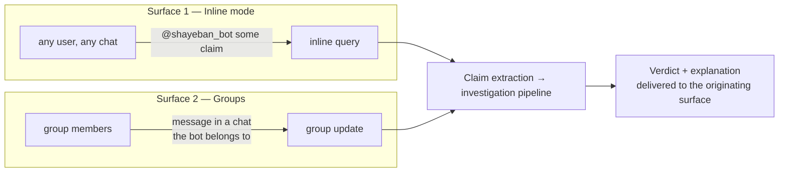
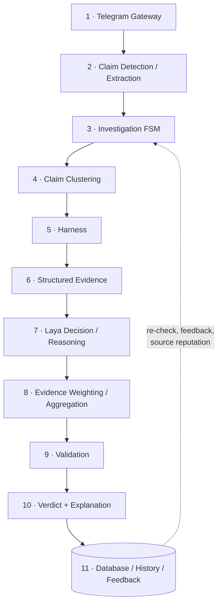

# System Overview

> Part of the Shayeban architecture docs. This is the entry point: what Shayeban
> is, how users reach it, the conceptual layer map every other doc refers to,
> and the shared vocabulary.

## 1. What Shayeban is

Shayeban is a Telegram-based claim/news fact-checking system. A user submits a
claim (explicitly, or implicitly by sending a message to a group the bot
watches); Shayeban investigates it against the open web, weighs the evidence,
and replies with a verdict plus a plain-language explanation.

It is built by a small team (5 people) as a **local-first, demonstrable MVP**
and an engineering portfolio piece — not as a production-launched service.
Every architectural choice below is scoped to that reality.

## 2. Product surfaces

Two entry points, **one investigation pipeline** behind them:

- **Inline mode** — users invoke `@shayeban_bot <claim>` from any chat, even
  where the bot is not a member (same interaction pattern as `@mira`). The
  claim enters the same pipeline as everything else.
- **Groups** — if Shayeban is present in a group, it inspects incoming
  messages, uses Laya to judge whether a message looks like a claim worth
  fact-checking, and starts an investigation when it does.

Whether an inline invocation can be answered *synchronously* (Telegram imposes
short timeouts) or must acknowledge and edit the message later is an open
product question — see `future-evolution.md` and the summary of open
questions.

## 3. Conceptual layer map

These are **conceptual boundaries**, not services. In the MVP they map to
modules inside one Python process (see `01-architecture.md`). The numbering is
referenced by the other docs.

| # | Layer | MVP module | One-line responsibility |
|---|---|---|---|
| 1 | Telegram Gateway | `bot_gateway` | Telegram I/O only: inline queries, group updates, replies |
| 2 | Claim Detection / Extraction | `claim_extraction` | Is it a claim? → canonical claim text + search queries |
| 3 | Investigation FSM | `investigation` | Owns investigation lifecycle/state; contains no fact-check logic |
| 4 | Claim Clustering | `harness` | Same-event grouping (embeddings), dedup/cache, volatility counters |
| 5 | Harness | `harness` | The only layer allowed to touch search APIs and the web |
| 6 | Structured Evidence | `harness` → `decision` | Sanitized, typed evidence package — the hand-off object |
| 7 | Laya Decision / Reasoning | `decision` | All Laya passes: claim detection, per-evidence stance, final verdict |
| 8 | Evidence Weighting / Aggregation | `weighting` | Source weights, independence gate, weighted roll-up |
| 9 | Validation | `validation` | Rule-based sanity guard on the produced verdict |
| 10 | Verdict + Explanation | `decision` + `explanation` | Final verdict persisted; template-based explanation |
| 11 | Database / History / Feedback | `persistence` | Postgres + pgvector: history, clusters, sources, feedback |

Two properties of this map are load-bearing:

- **Layer 5 → layer 6 is the trust boundary.** Everything below the harness
  (layers 6–10) only ever sees structured evidence the harness produced;
  scraped web content is untrusted data, never instructions
  (`security.md`).
- **Layers 7–8 are separable on purpose.** Retrieving evidence, evaluating it
  (Laya), weighting it, aggregating it, and producing the verdict are distinct
  steps so the model can be swapped without rewriting fact-checking logic
  (`06-laya.md`, `08-evidence-and-source-weighting.md`).

## 4. Glossary

| Term | Meaning |
|---|---|
| **Claim** | A single submitted statement (one forwarded message, one inline query). A row in `claims`. |
| **Claim cluster** | All claims judged to describe the same underlying event/claim, grouped by embedding similarity. Center of the schema; carries velocity/breaking state. |
| **Investigation** | One run of the pipeline against a cluster: FSM-managed, append-only history row with verdict. |
| **Evidence** | One fetched document judged relevant to the cluster, with provenance, stance, and confidence. |
| **Source** | A registered domain with a tier (`primary` / `journalism` / `factcheck` / `forum` / `unknown`). |
| **Harness** | The evidence-gathering subsystem: query generation → search → fetch → extract → tier → cluster → volatility. Sole external-content I/O. |
| **Laya** | A fast, non-autoregressive *System 1 decision engine* (calibrated probabilities, fixed answer sets). Used for structured decisions only — it does not generate free text. See `06-laya.md`. |
| **Verdict** | The final classification (`TRUE` / `FALSE` / `MISLEADING` / `UNCLEAR` …) plus a strength/confidence, per investigation. |
| **breaking_mode** | Cluster state set by the harness when document velocity is high; changes downstream thresholds and cache TTL. Never a truth signal by itself. |
| **Independence** | Two evidence items count as corroborating only if they are not copies of each other. Enforced by the independence gate in `weighting`. |

## 5. Where to go next

| Question | Doc |
|---|---|
| How is the MVP structured? What are the module boundaries? | `01-architecture.md` |
| What does each component own and exchange? | `02-components.md` |
| How does one investigation run end to end? | `03-investigation-lifecycle.md` |
| What are the FSM states and transitions? | `04-fsm.md` |
| How does evidence gathering work? | `05-harness-and-news-ingestion.md` |
| How is Laya integrated and versioned? | `06-laya.md` |
| What is persisted? | `07-database-schema.md` |
| How are sources/evidence weighted? | `08-evidence-and-source-weighting.md` |
| What do we observe? | `observability.md` |
| How is the development environment and CI designed? | `devops.md` |
| How is the stack deployed on a laptop? | `deployment.md` |
| How are models, prompts and configs versioned? | `mlops.md` |
| How is AI quality measured? | `evaluation.md` |
| What are the trust boundaries? | `security.md` |
| What is deliberately deferred, and where does it plug in? | `future-evolution.md` |
| What is missing today? | `architecture-gap-analysis.md` |
