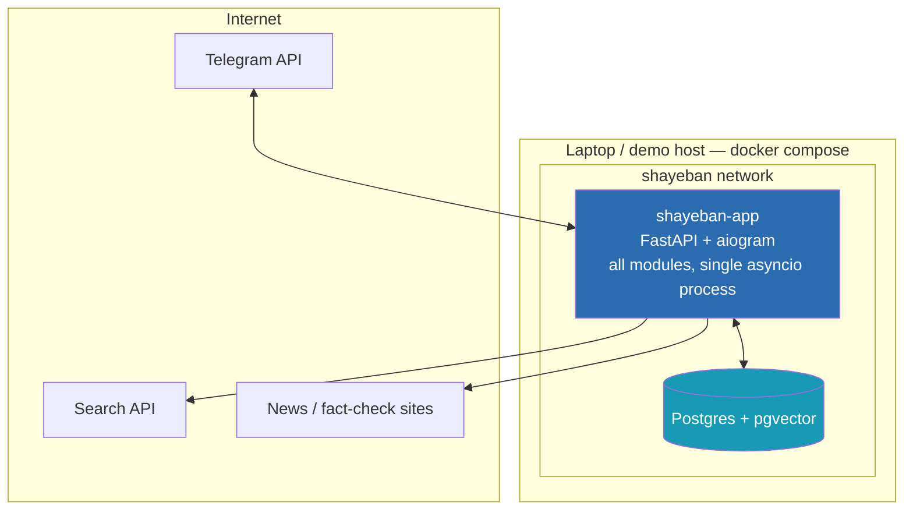

# MVP Architecture

> Part of the Shayeban architecture docs. The shape of the MVP: a modular
> monolith, its module map, the boundaries that exist and the ones still
> missing, and the one process split that is allowed to happen later.

## 1. Shape: modular monolith, one deployable service

For the MVP, Shayeban is **one deployable Python service** with clear internal
module boundaries — not microservices. (This continues the decision recorded
in the former `03-microservices-architecture.md`, whose content now lives
here, in `observability.md`, and in `mlops.md`.)

Why:

- aiogram and FastAPI run on the same asyncio event loop — splitting them
  into processes buys nothing now and adds network hops, serialization, and
  two things to deploy/monitor instead of one.
- Network calls between services fail in ways function calls don't (timeouts,
  partial failures, retries). That complexity is taken on only when a measured
  need demands it.
- Modules talk through plain Python function calls / async functions — no
  internal HTTP. Every seam below is therefore cheap to wrap in an API later:
  extracting a module into a service becomes "wrap the same function", not a
  redesign.

Scale evidence: 5-person team, no production server, GitHub + personal
laptops, portfolio demo. Designing for anything larger would be imaginary
scale.

## 2. Module map

```
shayeban/
├── bot_gateway/       # aiogram handlers, inline mode, group updates, replies — Telegram I/O only
├── claim_extraction/  # claim detection (via decision/), canonical claim, query generation
├── investigation/     # FSM definition + orchestration; no fact-check logic
├── harness/           # search, fetch, extract, source tiering, clustering, volatility
├── decision/          # ALL Laya passes: detection, per-evidence stance, final verdict
├── weighting/         # independence gate, source weights, weighted aggregation (pure logic)
├── validation/        # rule-based sanity guard on the produced verdict
├── explanation/       # template-based explanation builder (no LLM)
├── persistence/       # SQLAlchemy models & repositories (Postgres + pgvector), Alembic
└── api/               # FastAPI: /health, admin endpoints, future public API
```

Relative to the module list in the former `03-microservices-architecture.md`,
two modules are **added** and one scope is **narrowed**:

| Change | Module | Why |
|---|---|---|
| Added | `investigation/` | The FSM is a first-class subsystem with its own state and persistence needs; keeping it inside a handler module would bury lifecycle logic in I/O code. |
| Added | `weighting/` | Weighting + aggregation is pure logic (no model I/O) and the main future extension point (dynamic source reputation). It must be separable from Laya calls to satisfy the layered-reasoning requirement. |
| Narrowed | `decision/` | Was "per-evidence pass + aggregator + final pass". Now: the **single Laya port** — every Laya call in the system goes through it. Aggregation moved to `weighting/`. One module to repoint when the model or serving mode changes. |

Everything else (`bot_gateway`, `claim_extraction`, `harness`, `validation`,
`explanation`, `persistence`, `api`) keeps its existing name and role.

## 3. Boundaries

### 3.1 Boundaries that already exist (in the docs / design)

| Boundary | Where | What it guarantees |
|---|---|---|
| Untrusted web ↔ internal reasoning | `harness/` → structured evidence | Sanitization, tiering, and prompt-injection defenses live in one auditable place (`05-harness-and-news-ingestion.md`, `security.md`). |
| Telegram I/O ↔ domain logic | `bot_gateway/` | Handlers translate updates into `ClaimInput`; no fact-check logic in aiogram code. |
| Laya ↔ everything else | `decision/` | All model traffic behind one module — the seam for in-process → HTTP swap (`06-laya.md`). |
| Logic ↔ storage | `persistence/` | Repositories, not ad-hoc SQL scattered through modules. |
| Verdict ↔ prose | `explanation/` | Templates only; no LLM writes the user-facing text. |

### 3.2 Boundaries missing today (planned for the MVP)

| Missing boundary | Consequence without it | Fills in |
|---|---|---|
| FSM as its own module | lifecycle state scattered across handlers; restarts lose investigations | `investigation/` (`04-fsm.md`) |
| Weighting/aggregation vs. Laya | model and math entangled; can't tune weights or test aggregation without the model | `weighting/` (`08-evidence-and-source-weighting.md`) |
| Generative-model port for extraction/query-gen | an (as yet undecided) LLM baked directly into call sites | `claim_extraction/` (open question, see gap analysis) |
| Delivery abstraction (reply vs. inline answer vs. edit-later) | surface-specific code leaks into the pipeline | `bot_gateway/` (`03-investigation-lifecycle.md`) |
| Config/secrets boundary | tokens and keys hard-coded per environment | a dedicated settings module (`deployment.md` §5) |

## 4. Process & deploy shape

### 4.1 MVP: local-first Docker Compose



| Service | Image / build | Notes |
|---|---|---|
| `app` | built from repo | FastAPI + aiogram, single process, asyncio |
| `postgres` | `pgvector/pgvector:pg16` | Persistent volume, `CREATE EXTENSION vector` on init |

Deliberately **not** in the MVP: Redis, background workers, a message queue,
Kubernetes, any cloud service. `async`/`await` inside the single `app`
process runs searches/fetches concurrently without blocking the bot; a real
queue earns its complexity only once a single process provably can't keep up
— an evidence-based decision, not a guess (`observability.md` exists to
produce that evidence).

### 4.2 Laya: in-process now, a service when justified

The former `03-microservices-architecture.md` recommended splitting a **Laya
Decision Service** into its own container in V1, because `Router()` loads
model weights and every app restart would pay that cost. The current project
brief softens this to "*may* justify a separate process later".

Resolution for the MVP:

1. **Run Laya in-process**, but only ever through the `decision/` module,
   which satisfies the `PredictRunner` protocol already defined in the
   sibling `laya-lab` repo (`laya_typed.py`). In-process vs. HTTP is a
   constructor choice, not
   a code change — the dependency-inversion seam exists today.
2. **Split when measured pain appears**: restart/GPU contention makes the
   weight-loading cost visible in `observability.md` stage timings.
3. When splitting, prefer the upstream **`laya.serve`** HTTP surface
   (already ships with bearer auth, health probe, env-var config) over writing
   a bespoke wrapper — verify its `/v1/systemone` wire protocol fits our
   client first (`06-laya.md` §4, `future-evolution.md`).

This is a two-way door: cheap to reverse this month, expensive only if model
traffic is spread across call sites — which the `decision/` boundary
prevents.

## 5. Extension seams (summary)

Each future capability has a pre-identified home; details and triggers in
`future-evolution.md`.

| Future capability | Plugs in at |
|---|---|
| Dynamic source reputation | `weighting/` + `sources` table (data, not code) |
| New search provider / extraction library | `harness/` internals |
| Different or newer model | `decision/` port (and the `claim_extraction` generative port) |
| Laya as separate service | constructor swap behind `PredictRunner` |
| Job queue / workers | `investigation/` orchestration seam |
| Public API / admin UI | `api/` module |
| Feedback-driven weight tuning | `feedback` table → offline job → `sources`/`weighting` config |
