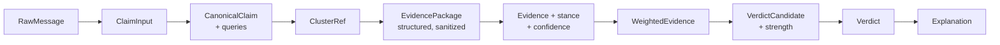
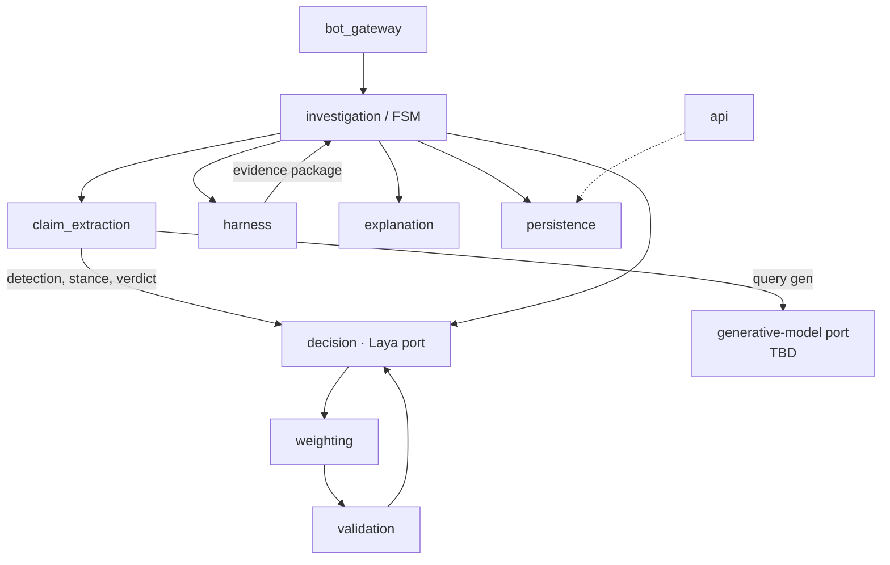

# Components

> Part of the Shayeban architecture docs. A catalog of the MVP's components:
> what each one owns, what it exchanges, and which data contracts cross module
> boundaries. Contracts are described conceptually (typed objects, not final
> class definitions).

## 1. Catalog

| Module | Kind | Owns | Reads/writes | Depends on |
|---|---|---|---|---|
| `bot_gateway` | I/O | aiogram handlers, inline queries, group updates, message formatting, delivery (reply / inline answer / edit-later) | Telegram API | `investigation`, `claim_extraction` (via `investigation`) |
| `claim_extraction` | I/O + model | claim detection call (delegates to `decision`), canonical claim text, bilingual query generation | generative-model port | `decision` (detection), `investigation` |
| `investigation` | orchestration | FSM definition, transitions, retries, timeouts, persistence of state | `investigations` rows | all stage modules (calls them; contains no fact-check logic) |
| `harness` | I/O | query execution, URL dedup, fetch, content extraction/normalization, source tier lookup, clustering, velocity/breaking, evidence candidates, per-investigation budget | search API, web, `claim_clusters`, `sources`, `evidence` | `persistence` |
| `decision` | model port | every Laya pass: detection, per-evidence stance, final verdict; question schemas (the "prompts") | Laya `Router` | `persistence` (schemas/config) |
| `weighting` | pure logic | independence gate, source tier weights, recency/corroboration modifiers, weighted roll-up → verdict candidate + strength | in-memory evidence + `sources` weights | none (pure functions) |
| `validation` | pure logic | rule guard on the verdict candidate (e.g. `TRUE` needs ≥ N independent high-tier sources; breaking-mode constraints) | verdict candidate | none (pure functions) |
| `explanation` | pure logic | verdict → human-readable explanation from templates; carries evidence citations | verdict + evidence | none |
| `persistence` | storage | SQLAlchemy models, repositories, Alembic migrations | Postgres + pgvector | — |
| `api` | I/O | `/health`, admin/inspection endpoints, future public API | HTTP | `persistence`, `investigation` |

**Kind** tells you how a component is tested: `pure logic` = unit tests, no
mocks; `model port` = contract tests with a fake runner (`FakeRunner`
pattern already proven in `laya-lab/test_laya_typed.py`); `I/O` = integration
tests with fakes at the edge.

## 2. Data contracts crossing boundaries

| Contract | Producer → consumer | Contents (conceptual) |
|---|---|---|
| `RawMessage` | `bot_gateway` → `investigation` | text, surface (inline/group), telegram ids, language hint, user ref |
| `ClaimInput` | `investigation` → `claim_extraction` | raw text + context; the FSM's `CLASSIFYING` payload |
| `CanonicalClaim` | `claim_extraction` → `harness` | normalized claim statement, language, generated queries (fa/en), detection result |
| `ClusterRef` | `harness` → downstream | cluster id, `breaking_mode`, velocity counters, cache-hit info (existing verdict if fresh) |
| `EvidencePackage` | `harness` → `decision` | list of evidence items: url, domain/source tier, publish/fetch dates, sanitized content snippet, provenance |
| `Evidence + stance` | `decision` → `weighting` | per-item `support`/`contradict`/`irrelevant` + calibrated confidence from Laya |
| `WeightedEvidence` | `weighting` → `validation`/`decision` | per-item weight after independence gate + tier/recency modifiers; roll-up totals |
| `VerdictCandidate` | `weighting` → `validation` → `decision` | provisional verdict, strength, breaking-mode context |
| `Verdict` | `decision` → `explanation`, `persistence` | final verdict, strength, model/question-schema version, investigation id |
| `Explanation` | `explanation` → `bot_gateway` | rendered text + citations, delivery instructions |

Rules that keep these contracts honest:

- **Nothing downstream of the harness ever receives raw HTML** — only the
  sanitized `EvidencePackage` (`security.md`).
- **`weighting` and `validation` are pure**: same inputs → same outputs, so
  verdict math is testable and explainable without a model or a database.
- **Versioned fields ride along**: `Verdict` carries the Laya checkpoint id
  and question-schema version so every investigation is reproducible
  (`mlops.md`).

## 3. Who calls whom (runtime view)

Notes:

- `investigation` is the **only** orchestrator; stage modules never call each
  other sideways (except `claim_extraction → decision`, which is the Laya
  port, not a pipeline shortcut).
- `persistence` is called by stage modules through repositories — the FSM
  does not embed SQL, and the harness does not know about aiogram.

## 4. Dependency rules

1. Stage modules depend **inward** on contracts, not on Telegram, HTTP, or
   SQL details.
2. Only `bot_gateway`, `harness`, `api`, and `decision`'s runner may perform
   external I/O.
3. `weighting`, `validation`, `explanation` import nothing from I/O modules —
   enforced by convention in the MVP, by a lint rule later if it starts
   slipping.
4. No module imports another module's internal submodules; only the public
   functions/types a module exports.
