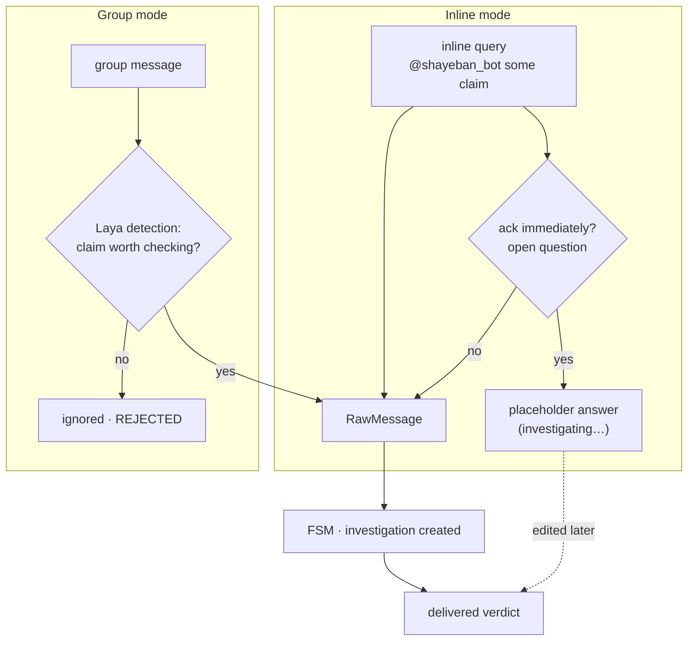
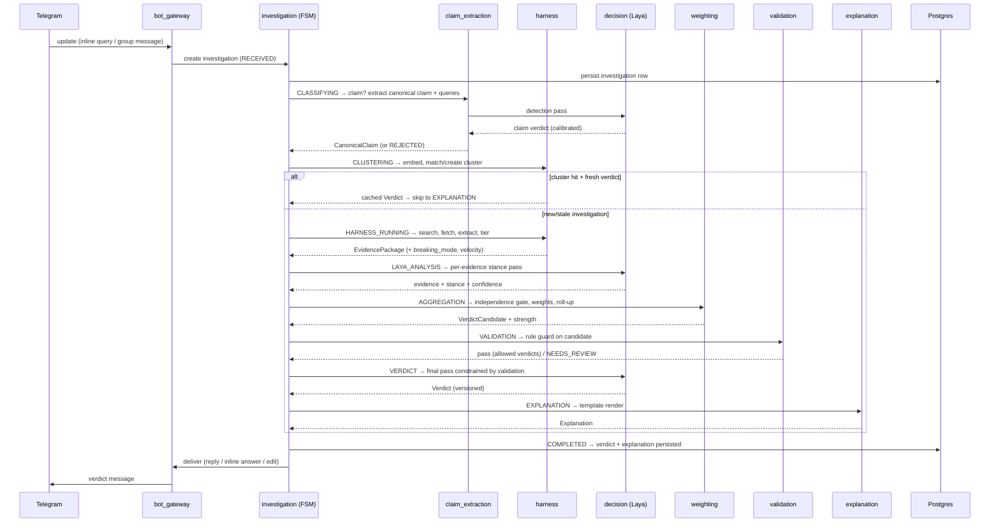

# Investigation Lifecycle & Data Flow

> Part of the Shayeban architecture docs. How one investigation runs end to
> end — from a Telegram update to a delivered verdict — and what data exists
> at each step. State-by-state transition rules live in `04-fsm.md`; this doc
> is the narrative and the data-flow view.

## 1. Entry paths

Both surfaces converge on the same first step: build a `RawMessage` and hand
it to the investigation FSM.

- **Inline**: the query text is the claim; no group membership required.
  Whether the surface supports "ack now, edit later" is an open Telegram
  question (`future-evolution.md` Q1) — either way the investigation
  itself is identical.
- **Group**: the message goes through claim detection (a Laya pass via
  `decision`) *before* an investigation is created; non-claims never enter
  the FSM (`REJECTED` without cost).

## 2. Happy path (sequence)

## 3. Data flow — what exists at each stage

| Stage (FSM state) | Data in | Data out | Owner module |
|---|---|---|---|
| `RECEIVED` | Telegram update | `RawMessage`, investigation row | `bot_gateway` → `investigation` |
| `CLASSIFYING` | `RawMessage` | detection result, `CanonicalClaim` + fa/en queries | `claim_extraction` (+ `decision`) |
| `CLUSTERING` | canonical text | `ClusterRef` (or new cluster); possible **cache hit** | `harness` |
| `HARNESS_RUNNING` | queries + cluster | evidence candidates → sanitized `EvidencePackage` | `harness` |
| `LAYA_ANALYSIS` | `EvidencePackage` | evidence + stance + confidence | `decision` |
| `AGGREGATION` | stanced evidence, `sources` weights, breaking-mode | `VerdictCandidate` + strength | `weighting` |
| `VALIDATION` | `VerdictCandidate` + rules | validated candidate (allowed verdict set) or `NEEDS_REVIEW` | `validation` |
| `VERDICT` | validated candidate + evidence | `Verdict` (with model/schema version) | `decision` |
| `EXPLANATION` | verdict + citations | rendered `Explanation` | `explanation` |
| `COMPLETED` | everything above | persisted investigation; Telegram delivery | `persistence` → `bot_gateway` |

## 4. The cache/dedup path

`CLUSTERING` is also where an existing answer can short-circuit the run —
the dedup/cache layer is the same mechanism that powers clustering:

- Cluster matched **and** its latest verdict fresh (normal TTL, e.g. 24h) →
  skip straight to delivery of the cached verdict, record the new claim
  occurrence against the cluster.
- Cluster matched but verdict stale — or `breaking_mode` collapsed the TTL
  (15–30 min) → run a fresh investigation.
- No match → new cluster, full run.

This is why the cluster (not the individual claim) is the center of the
schema: 1000 forwards of the same rumor collapse into one cluster with one
investigation history, while every occurrence still updates virality counters
(`08-evidence-and-source-weighting.md` §4).

## 5. Failure and review branches

| Outcome | When | User sees |
|---|---|---|
| `REJECTED` | not a claim, policy/quota refusal, budget exhausted pre-clustering | (group: silence; inline: "no claim detected") |
| `NEEDS_REVIEW` | validation guard unsatisfied, contradictory high-tier evidence, low confidence | verdict held back; row enters the human review queue (`feedback.reviewed = false`) |
| `FAILED` | retries exhausted (search down, fetch timeouts, Laya error) | "investigation failed, try later" |
| `RETRYING` | transient error, attempt < max, backoff | nothing yet |
| `UNCLEAR` verdict | legitimate thin/stale/developing evidence — *not* a failure | verdict: UNCLEAR + reason (developing story / insufficient independent sources) |

`UNCLEAR` is an answer; `FAILED` is an operational error. Keeping them
distinct is what lets observability separate "the world is ambiguous" from
"our pipeline is broken" (`observability.md`).

## 6. Delivery

| Surface | Mechanism |
|---|---|
| Group | reply to the triggering message (or channel post), verdict + explanation + citations |
| Inline | answer inline query (ack or result); edit final verdict later if async pattern is confirmed |
| Both | delivery is `bot_gateway`'s concern only — the pipeline emits an `Explanation`, not a Telegram message |

---

**4/21** · [← 02 · Components](02-components.md) · [Docs index](README.md) · [04 · FSM →](04-fsm.md)
