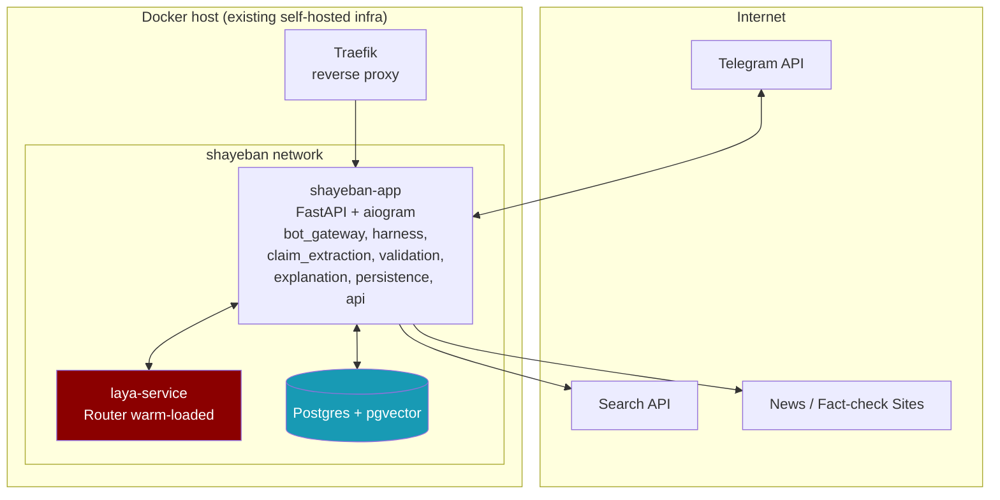

# Microservices Architecture & Deployment

> Part of the Shayeban architecture docs. Covers service boundaries for V1
> (deliberately a modular monolith, not true microservices) and the concrete
> trigger for when to actually split.

## 1. V1 Decision: Modular Monolith, Not Microservices

For the MVP, this doc recommends **one deployable Python service** with clear
internal module boundaries, rather than separate microservices communicating
over the network. Reasoning:

- aiogram and FastAPI both run on the same asyncio event loop — splitting
  them into separate processes buys nothing for V1 and adds network hops,
  serialization, and two things to deploy/monitor instead of one.
- Network calls between services fail in ways function calls don't (timeouts,
  partial failures, retries) — that complexity should only be taken on when
  a specific scaling or isolation need demands it, not by default.
- Fast MVP shipping is an explicit priority; a monolith with clean internal
  boundaries can be split later along exactly the seams already drawn by the
  module structure below, with much less rework than getting the service
  boundaries wrong upfront.

## 2. Internal Module Boundaries (within the one service)

```
shayeban/
├── bot_gateway/       # aiogram handlers, Telegram-specific logic only
├── claim_extraction/  # light generative LLM call: text -> canonical claim + queries
├── harness/           # search, fetch, extract, source tiering, clustering, volatility
├── decision/          # Laya Router wrapper: per-evidence pass + aggregator + final pass
├── validation/        # rule-based sanity guard on Laya's output
├── explanation/        # template-based explanation builder (no LLM)
├── persistence/       # DB models & queries (Postgres + pgvector)
└── api/               # FastAPI routes (future public API, admin endpoints)
```

Each module talks to the others through plain Python function calls / async
functions — no internal HTTP. This is what makes a later split cheap: the
`decision/` module, for example, already has a clean input (evidence package)
and output (verdict) boundary, so extracting it into its own service later is
a matter of wrapping the same function behind an API, not a redesign.

## 3. The One Concrete Reason to Split Early: the Laya Service

There is one piece worth pulling out into its own long-running process from
early on, and it's not about scaling load — it's about **model load time**.
`Router()` loads model weights into memory. If `decision/` runs inside the
same process as `bot_gateway/`, every bot restart (deploys, crashes, config
reloads) pays the weight-loading cost again and briefly blocks investigations.

Recommendation: run a small **Laya Decision Service** (a thin FastAPI or gRPC
wrapper around `Router()`) as its own container, loaded once and kept warm.
The main application calls it over a local network hop (same Docker network,
low latency). This is a narrow, well-justified split — not a general
"everything is a microservice" pattern — and it's the only service boundary
worth drawing in V1 beyond the monolith itself.

## 4. Deployment Diagram (Docker Compose, V1)



`docker-compose.yml` service list for V1:

| Service | Image / build | Notes |
|---|---|---|
| `app` | built from repo | FastAPI + aiogram, single process, asyncio |
| `laya-service` | built from repo (separate Dockerfile) | Warm-loaded `Router()`, internal-only network |
| `postgres` | `pgvector/pgvector:pg16` | Persistent volume, `CREATE EXTENSION vector` on init |
| `traefik` | official image | Reuses the same reverse-proxy pattern already used for other self-hosted services |

Deliberately **not yet in V1**: Redis, background workers, a message queue.
As covered in the main architecture doc, `async`/`await` inside the single
`app` service is sufficient to run searches/fetches concurrently without
blocking the bot — a real job queue only earns its complexity once a single
process provably can't keep up with load, which is a scaling problem to solve
with production metrics in hand, not a guess to build against now.

## 5. Observability (lightweight V1 version)

Even before full Prometheus/Grafana (listed as a "later" item in the
original spec), log these structured fields on every investigation from day
one, since they're needed to make the *later* monitoring decisions correctly:

- Search API calls and cost per investigation
- Cache hit vs. miss (dedup layer effectiveness)
- Time spent per pipeline stage (extraction, search, fetch, decision)
- `breaking_mode` transitions per cluster

Without this from V1, there's no data to know *when* the modular monolith
actually needs to become real microservices, or when the async-only approach
needs to become a real queue — the decision to add that complexity should be
evidence-based, same as the product itself.
