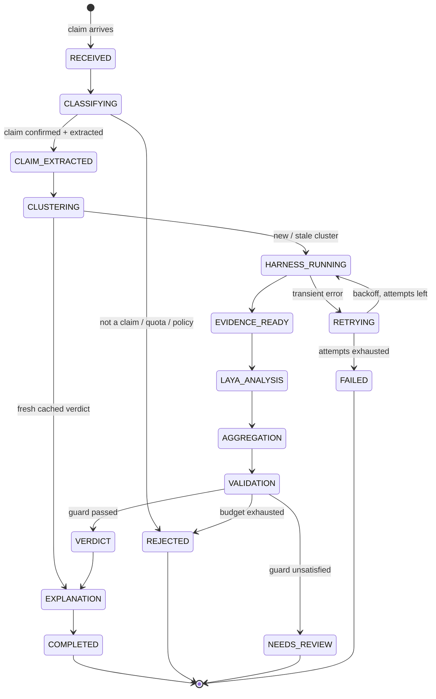

# Investigation FSM

> Part of the Shayeban architecture docs. The explicit state machine that
> manages an investigation's lifecycle. The FSM decides **what happens next**;
> it never contains fact-checking logic (that lives in the stage modules
> listed in `02-components.md`).

## 1. States

| State | Owner module | Meaning |
|---|---|---|
| `RECEIVED` | `investigation` | Investigation row created; raw message accepted |
| `CLASSIFYING` | `claim_extraction` | Detection confirmed + canonical claim + fa/en queries produced |
| `CLAIM_EXTRACTED` | `claim_extraction` | Checkpoint: we know *what* is being claimed |
| `CLUSTERING` | `harness` | Embedded; matched to existing cluster or new one created; cache checked |
| `HARNESS_RUNNING` | `harness` | Search / fetch / extract / tier in progress (budget-bounded) |
| `EVIDENCE_READY` | `harness` | Checkpoint: sanitized `EvidencePackage` + cluster state (breaking_mode) persisted |
| `LAYA_ANALYSIS` | `decision` | Per-evidence stance pass |
| `AGGREGATION` | `weighting` | Independence gate, weights, weighted roll-up → `VerdictCandidate` |
| `VALIDATION` | `validation` | Rule guard on the candidate (pre-verdict sanity) |
| `VERDICT` | `decision` | Final pass constrained by validation → `Verdict` persisted |
| `EXPLANATION` | `explanation` | Template render with citations |
| `COMPLETED` | `investigation` → `bot_gateway` | Persisted; delivered to the originating surface |
| `REJECTED` | — | Terminal: not a claim, quota, policy, or pre-evidence budget stop |
| `NEEDS_REVIEW` | — | Terminal (held): enters human review queue (`feedback.reviewed = false`) |
| `FAILED` | — | Terminal: retries exhausted / unrecoverable error |
| `RETRYING` | `investigation` | Transient error; backoff, then resume the failed state |

Checkpoints (`CLAIM_EXTRACTED`, `EVIDENCE_READY`) exist so a restart or a
failure never loses expensive work — the next run resumes from persisted
intermediates instead of re-fetching the web.

## 2. Transition rules

- **Every transition is logged** (structured, with `investigation_id`) — the
  transition history lives in logs, not in a second database table
  (`observability.md`).
- **`investigations.state` holds the current state**; it is written
  transactionally with the work that caused the transition, so a crash leaves
  a truthful row (`07-database-schema.md`).
- **Retry policy**: attempts counted per investigation (MVP: max 3, linear or
  exponential backoff). Retry applies to transient I/O errors (search timeout,
  fetch failure, Laya error) — never to logical rejections.
- **Budget stop**: if the per-investigation budget from
  `05-harness-and-news-ingestion.md` §6 is exhausted, the FSM goes to
  `REJECTED` (pre-evidence) or issues `UNCLEAR — investigation incomplete`
  (post-evidence) rather than retrying forever.
- **Cache short-circuit**: a fresh cached verdict at `CLUSTERING` skips to
  `EXPLANATION` (only rendering + delivery run).

## 3. Invariants

1. The FSM contains **no fact-checking logic** — no thresholds, no prompts, no
   weighting math. It only sequences module calls and records outcomes.
2. Every investigation is in **exactly one** state at any time.
3. Only `investigation/` changes state; stage modules return results, never
   FSM instructions (they may return "retryable: yes/no").
4. Terminal states are final for that investigation; re-checks create a new
   investigation against the same cluster (history stays append-only).

## 4. Placement notes (deviations from the brief's sketch)

The brief's conceptual sketch showed `VALIDATION → VERDICT` — this FSM keeps
that order deliberately:

- Validation guards the **candidate** (evidence sufficiency, independence,
  breaking-mode constraints) and can restrict which verdicts the final pass is
  allowed to select — a stronger guarantee than only vetoing after the fact.
- Pre-verdict sanity defaults (e.g. thin evidence → force `UNCLEAR` in
  breaking mode) live in `AGGREGATION` per `05-harness-and-news-ingestion.md`
  §5.3; `VALIDATION` is the independent guard in front of `VERDICT`.
- The final Laya pass is additionally schema-constrained (fixed option sets +
  Pydantic), so its output cannot silently leave the allowed verdict space.

Group messages pass a **cheap Laya detection gate in `bot_gateway` before
`RECEIVED`** (non-claims never create rows); inline invocations always enter
the FSM, and `CLASSIFYING` performs detection + extraction. See
`03-investigation-lifecycle.md` §1.

## 5. Restart policy (MVP)

- On startup: investigations not in a terminal state and older than a
  threshold are marked `FAILED` (`interrupted by restart`). Simple, truthful,
  no resurrection bugs.
- **Resume-from-checkpoint** is a deferred enhancement — the checkpoints make
  it possible without schema changes (`future-evolution.md`).

## 6. Open questions

- Q: Should `NEEDS_REVIEW` later transition (via human action) to a reopened
  investigation instead of staying terminal? — deferred with the feedback
  loop.
- Q: Exact per-state timeouts and overall investigation deadline (needs
  empirical timings from the first working pipeline).
