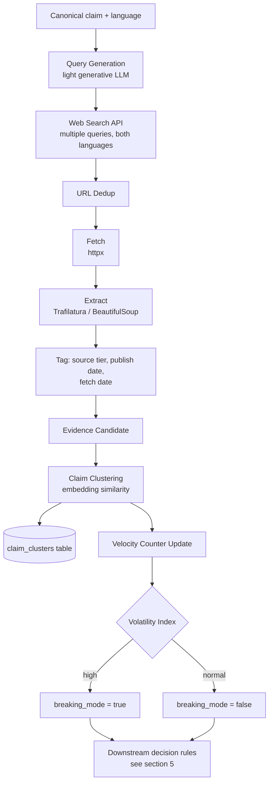

# Harness & News Ingestion Layer

> Part of the Shayeban architecture docs. This document covers the evidence-gathering
> harness: how claims are turned into search queries, how sources are fetched and
> tiered, and — critically — how the system behaves differently when a topic is
> **breaking** (many new articles arriving in a short window) versus **stable**.

## 1. Purpose

The harness is the only layer allowed to touch the outside world (search APIs,
web pages). Everything downstream (Laya, the aggregator, the bot) only ever sees
**structured evidence objects** that the harness produced. This boundary matters
for two reasons:

- It keeps untrusted web content contained in one place, so sanitization and
  prompt-injection defenses live in a single, auditable spot instead of being
  re-implemented everywhere.
- It lets the "how do we search" logic evolve (new search API, new extraction
  library, new source-tier rules) without touching the reasoning layer at all.

## 2. Source Registry (config-driven, not hardcoded)

Source credibility is **data**, not code. Store it as a table (see
`07-database-schema.md`, `sources`), not as a Python dict baked into a deploy.

| Tier | Examples | Weight in aggregation |
|---|---|---|
| `primary` | official health ministries, court records, company statements | highest |
| `journalism` | established news outlets with editorial standards | high |
| `factcheck` | dedicated fact-checking organizations | high |
| `forum` | social media, forums, Telegram channels | discovery only, near-zero weight as *proof* |
| `unknown` | anything not yet classified | zero weight until reviewed |

A source's tier can change over time (an outlet's reputation shifts) — that's
exactly why this lives in the database and is editable without a code deploy.

## 3. Ingestion Pipeline



Notes:

- **Both languages are queried regardless of the claim's input language.** A
  Persian claim about an international event will often only be confirmed or
  rejected by English-language sources first. Query generation should produce
  both Persian and English search queries for every claim, not just a
  translation of one query.
- Every fetched page is treated as **untrusted data**: strip scripts/markup
  before it ever becomes part of a prompt or a Laya `state` object. Never let
  scraped text be interpreted as instructions.

## 4. Claim Clustering — a prerequisite for volatility tracking

Before velocity can be measured, the harness needs to know which incoming
claims are *the same event* being described differently. This is done with
embedding similarity against `claim_clusters.embedding` (pgvector):

- New claim arrives → embed the canonical text.
- Vector search against existing clusters (last N days).
- Similarity above threshold → attach to existing cluster, update
  `last_seen_at`.
- No match → create a new cluster.

This clustering is also what powers the dedup/cache path described in
`03-investigation-lifecycle.md` §4 — it is the same mechanism serving two
purposes (cost
control *and* volatility measurement), which is why it belongs in the harness
rather than being duplicated.

## 5. Volatility Index — why "100 new articles" should change the answer

This is the direct answer to the question that motivated this document: **the
number and rate of incoming documents about a topic should change how
confidently the system commits to a verdict**, not just what the verdict is.

### 5.1 The problem

A real, true event (say, an escalation between two countries) takes 10–30
minutes for tier-1 sources to confirm, even though social forwards about it
spread in seconds. If the harness searches during that gap and finds nothing
from `primary`/`journalism` sources yet, a naive system concludes "no evidence
found → REJECTED". That is exactly backwards — the event may be true and
simply not yet confirmed. The failure mode is: **treating absence of
confirmation as confirmation of absence**, which gets worse precisely when it
matters most (fast-moving, high-stakes situations).

### 5.2 Definitions

For each `claim_cluster`, maintain rolling counters:

```
velocity(cluster, window) = distinct new evidence documents ingested
                             in the last `window`, related to this cluster
```

Track at least two windows: `15m` and `1h`. A simple, explainable V1 rule
(no ML needed here — this is a counting/threshold problem):

```
if velocity(cluster, 15m) >= HIGH_VELOCITY_THRESHOLD:
    breaking_mode = true
elif velocity(cluster, 1h) < LOW_VELOCITY_THRESHOLD:
    breaking_mode = false
# else: keep previous state (hysteresis, avoids flapping)
```

Start with a fixed threshold for V1 (e.g. `HIGH_VELOCITY_THRESHOLD = 10` new
documents in 15 minutes). A per-topic-category baseline (some categories are
naturally noisier) is a reasonable v2 refinement, not a V1 requirement.

### 5.3 What `breaking_mode` actually changes downstream

This flag is read by the aggregation step (`weighting/`, layer 8 of
`00-system-overview.md`) and changes behavior along four axes:

| Axis | Normal mode | Breaking mode |
|---|---|---|
| Default when evidence is thin | Proceed with what's available | Force `UNCLEAR` — explicitly labeled "developing, re-check soon" |
| Confirmation bar | e.g. 2 agreeing `primary`/`journalism` sources | 3+, with recency cross-check (published within the current volatility window) |
| Cache TTL for this cluster | Long (e.g. 24h) | Short (e.g. 15–30 min) — forces re-investigation instead of serving a stale cached verdict |
| Poll/re-check interval | Hours | 1–2 minutes |

The key design point: **the aggregation logic (`weighting/`, layer 8) must
receive `breaking_mode` as part of the evidence package state**, not decide it
independently — the harness is the only layer with the ingestion-rate data
needed to compute it.

### 5.4 Concrete effect on the "100 new articles" scenario

If 100 new documents about a cluster arrive in 15 minutes:

1. `velocity(cluster, 15m)` crosses the threshold → `breaking_mode = true`.
2. Cache TTL for any *existing* verdict on this cluster collapses to the
   short window — any user forwarding this claim triggers a fresh check
   instead of getting a (now possibly outdated) cached answer.
3. The aggregator raises its confirmation bar and the explanation template
   (layer 10 — see `02-components.md`) explicitly states the situation is developing,
   e.g.: *"This is a fast-moving story (100+ new reports in the last 15
   minutes). Verdict: UNCLEAR — re-check recommended."*

This is the mechanism that keeps a real breaking event from being
mislabeled as a rejected rumor, without requiring any judgment call from
Laya — it is pure counting and threshold logic, owned entirely by the
harness.

## 6. Rate Limiting & Cost Control

Each investigation costs money (search API calls + fetch bandwidth + compute).
Enforce a **budget per investigation**, not just per user:

- Max N search queries per claim (e.g. 4: 2 Persian, 2 English).
- Max M fetches per query (e.g. top 5 results).
- If the budget is exhausted before reaching a confident aggregation, return
  `UNCLEAR — investigation incomplete`, never silently retry indefinitely.

Combine this with per-user daily quotas (tracked in `users.daily_quota_used`,
see `07-database-schema.md`) to prevent abuse from burning the shared budget.

---

<sub>**6/21** · [← 04 · FSM](04-fsm.md) · [Docs index](README.md) · [06 · Laya →](06-laya.md)</sub>
