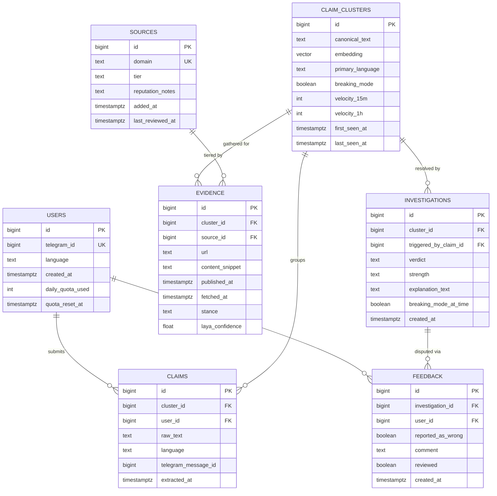

# Database Schema

> Part of the Shayeban architecture docs. Covers the persistence layer: table
> design, the reasoning behind PostgreSQL + pgvector from day one, and indexing.

## 1. Why Postgres + pgvector from V1 (overriding the original SQLite plan)

The original spec proposed "SQLite → PostgreSQL" as a later migration. This
doc recommends starting on Postgres with the `pgvector` extension
**immediately**, for one concrete reason: the dedup/cache path (the
highest-leverage piece of the whole architecture — see
`03-investigation-lifecycle.md` §4) requires vector similarity search over claim embeddings. SQLite has no
native vector index. Migrating a growing `claims` table from SQLite to
Postgres later is realistic; migrating it to also grow a vector index at the
same time is unnecessary extra work when Postgres does both from the start,
and it is already the team's planned production database anyway.

## 2. Entity-Relationship Diagram



## 3. Table Notes

### `claim_clusters`
The center of the schema. `embedding` (via pgvector) is what powers both the
dedup/cache lookup and the volatility velocity counters described in
`05-harness-and-news-ingestion.md`. `breaking_mode`, `velocity_15m`, and
`velocity_1h` are denormalized onto this table deliberately — they are read on
almost every request to this cluster, so keeping them as columns (updated by
the ingestion job) avoids recomputing them from raw `evidence` rows on every
lookup.

### `claims`
Each individual forwarded message a user sends is a row here, linked to the
cluster it was matched against. This is what allows "1000 people forwarded
basically the same rumor" to collapse into one `claim_cluster` with one
`investigations` history, while still preserving per-user history for
features like "your check history" (a V2 feature in the original spec).

### `sources`
The editable tier registry from the harness doc. `last_reviewed_at` supports
a periodic manual audit — source reputation is not static.

### `evidence`
`stance` (`support` / `contradict` / `irrelevant`) and `laya_confidence` are
filled in by the **per-evidence Laya pass** (`LAYA_ANALYSIS`, layer 7 —
see `04-fsm.md` and `06-laya.md`) — not by the harness itself. The harness
only populates everything up through `fetched_at`; the decision layer writes
`stance` and `laya_confidence` back onto the same row.

### `investigations`
One row per completed investigation run. Keeping this as an append-only log
(rather than a single "current verdict" field on `claim_clusters`) is what
enables the "re-check / update" feature from the original spec for free —
history is just "all investigations for this cluster, ordered by
`created_at`". `breaking_mode_at_time` is stored explicitly so that a verdict
issued during a fast-moving situation is visibly flagged as such even after
`claim_clusters.breaking_mode` later flips back to `false`.

### `feedback`
Backs the "human review for difficult cases" V2 feature. `reviewed = false`
rows are the review queue.

## 4. MVP deltas (FSM state, provenance, versioning)

The base schema above was written before the current doc set; four additions
are required by it and belong in the first migration:

| Table | Column(s) | Why |
|---|---|---|
| `investigations` | `state text not null`, `state_updated_at timestamptz`, `attempts int default 0` | the FSM must survive restarts — `investigations.state` is the single current-state column (`04-fsm.md`); transition *history* lives in structured logs, not a table |
| `investigations` | `laya_checkpoint text`, `laya_version text`, `question_schema_version text` | every verdict records what produced it (`06-laya.md` §5, `mlops.md` §3) |
| `evidence` | `derived_count int default 1` | output of the independence gate: how many copies this representative stands for — copies inform virality, never weight (`08-evidence-and-source-weighting.md` §3.1) |
| `investigations` | `strength` already exists; add `verdict_extras jsonb` only if the final pass grows extra fields | keep the log forward-compatible without ALTERing on every schema tweak |

Deliberately **not** added: denormalized occurrence/unique-user counters on
`claim_clusters` (cheap to compute from `claims` at MVP volumes — denormalize
only when measured hot), and any weights/reputation history tables
(`08-…` §5, deferred with the feedback loop).

## 5. Indexing Strategy

```sql
-- Vector similarity search for dedup + clustering
CREATE INDEX ON claim_clusters USING ivfflat (embedding vector_cosine_ops);

-- Fast tier lookup during evidence ranking
CREATE INDEX ON sources (domain);

-- Latest evidence per cluster
CREATE INDEX ON evidence (cluster_id, fetched_at DESC);

-- Latest verdict per cluster (cache lookup path)
CREATE INDEX ON investigations (cluster_id, created_at DESC);

-- Pending human review queue
CREATE INDEX ON feedback (reviewed) WHERE reviewed = false;

-- Restart sweep: investigations not in a terminal state
CREATE INDEX ON investigations (state_updated_at)
    WHERE state NOT IN ('COMPLETED', 'REJECTED', 'FAILED', 'NEEDS_REVIEW');
```

The `ivfflat` index requires an approximate row-count estimate to tune
`lists` properly once there's real data volume; for the MVP, the default is
fine and can be re-tuned after the first few weeks of production data.

---

<sub>**8/21** · [← 06 · Laya](06-laya.md) · [Docs index](README.md) · [08 · Evidence & weighting →](08-evidence-and-source-weighting.md)</sub>
