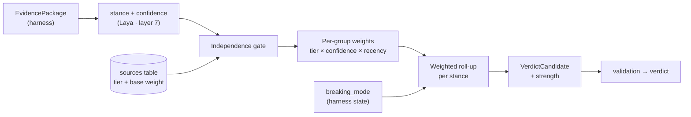

# Evidence & Source Weighting

> Part of the Shayeban architecture docs. How individual evidence items become
> a verdict: the independence gate, source weights, the MVP's simple
> aggregation rules — and the invariants that keep repetition from masquerading
> as truth. Implemented by the pure-logic `weighting/` module (layer 8).

## 1. Position in the pipeline



Weighting sits **between evaluation and the verdict** and is pure logic: no
model calls, no I/O, no Telegram. Same inputs → same outputs, fully unit
testable and explainable.

## 2. The two invariants

1. **Viral ≠ true.** Repetition of a claim (or of its mentions) never moves a
   verdict toward truth. Popularity only affects *attention* behavior:
   significance, freshness, breaking-mode, re-check scheduling (§4).
2. **Copies ≠ corroboration.** Ten articles that restate one wire report are
   **one** independent source. Independence is established *before* weights
   are summed — after the gate, a rumor spread across 200 syndicated copies
   has the weight of its origin.

## 3. MVP weighting model (simple, explainable)

Deliberately not a learned model. Three steps, all deterministic:

### 3.1 Independence gate

Group evidence items that derive from the same origin; each group counts once:

- canonicalize URLs (strip tracking params, fragments, `www`, mobile hosts);
- near-duplicate content detection on the extracted snippet (hash for exact
  copies; embedding similarity — already available from clustering — for
  paraphrases);
- record `derived_count` on the surviving item (copies are *information about
  virality*, not about truth).

### 3.2 Per-group weight

```
weight = base(tier) × laya_confidence × recency_factor
```

| Input | MVP rule |
|---|---|
| `base(tier)` | from the editable registry (`05-harness-and-news-ingestion.md` §2): `primary` > `journalism` ≈ `factcheck` > `forum` (discovery only) > `unknown` (0 until reviewed) |
| `laya_confidence` | calibrated probability of the stance — usable as-is |
| `recency_factor` | simple bands: fresh (≤24h) = 1.0, aging = reduced, stale = floor (non-zero — old evidence can still contradict) |
| `breaking_mode` | changes *thresholds and defaults* (§3.3, and `05-…` §5.3), not the weights themselves |

All numbers are **configuration, not code** — tunable without a deploy
philosophy; stored in config for the MVP, later in DB rows if they start
moving (`future-evolution.md`).

### 3.3 Roll-up → verdict candidate

Sum weights per stance (`support` / `contradict`); apply rules:

- candidate = whichever stance dominates by a required margin;
- **minimum bars** — e.g. `TRUE`/`FALSE` require ≥ 2 independent groups
  including ≥ 1 `primary`/`journalism`; `forum`-only evidence can yield at
  most `UNCLEAR`;
- **breaking mode raises the bars** (3+ independent, recency cross-checked)
  and forces `UNCLEAR — developing` when evidence is thin;
- `strength` (strong / moderate / weak) from how decisively the totals
  separate — a wide margin with thin evidence is still *weak*, not *strong*.

The output is a `VerdictCandidate`, independently guarded by `validation/`
before the final pass (`04-fsm.md`).

## 4. Claim repetition / virality (tracked, never weighted into truth)

Per cluster, track (from `claims` rows; denormalize only if hot):

| Signal | Derived from | Influences |
|---|---|---|
| occurrences | `count(claims)` | significance badge, dedup hits |
| unique users | `count(distinct user_id)` | abuse detection, significance |
| independent sources | post-gate evidence groups | **verdict confidence only** (§3) |
| velocity (15m / 1h) | evidence ingestion windows | `breaking_mode`, cache TTL, re-check interval |
| recency of activity | `last_seen_at` | freshness of cached verdicts |

The UI/explanation may say "seen 1,200 times today" — that string sits next
to the verdict, never inside its computation.

## 5. Where dynamic reputation grows (deferred, but the door is open)

| Future capability | Lands at | MVP stand-in |
|---|---|---|
| Historical accuracy per source | new columns on `sources`, updated by offline job from `feedback` | static tier + manual review (`last_reviewed_at`) |
| Contradiction history | same, counter of contradicted verdicts the source supported | none |
| Learned / tuned weights | offline analysis over `investigations` + `feedback`; outputs config rows | hand-tuned thresholds |
| Feedback loop | `feedback` table → reviewed cases → weight/tier updates | review queue (`reviewed = false`) |

Because weights live in **data** (`sources` + config) and the math lives in
one **pure module**, growing into any of these requires no pipeline rewrite —
that is the extension point this doc exists to protect.

## 6. Testability

`weighting/` and `validation/` are pure functions over plain structures:
property tests (adding a copy never increases totals; a `forum`-only set never
yields `TRUE`; breaking mode never lowers a threshold), plus golden cases
from the eval set (`mlops.md`).

---

<sub>**9/21** · [← 07 · Database schema](07-database-schema.md) · [Docs index](README.md) · [Architecture gap analysis →](architecture-gap-analysis.md)</sub>
