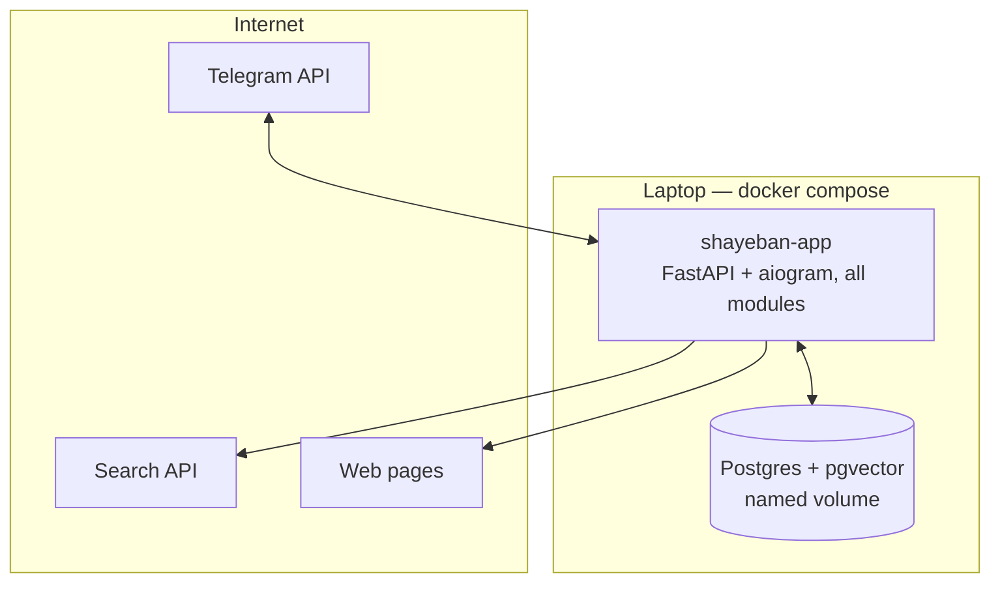

# DevOps / MLOps Direction

> Part of the Shayeban architecture docs. How the MVP is built, run,
> versioned, and evaluated — local-first on laptops and GitHub, with an
> explicit list of what is intentionally absent. (Absorbs §4 of the former
> `03-microservices-architecture.md`.)

## 1. Principles

- **Local-first**: `docker compose up` on a laptop is the whole deployment.
  No production server exists; nothing in the MVP may require one.
- **Reproducible**: pinned dependencies, pinned model weights, config via
  environment, secrets outside git.
- **Evidence-based growth**: observability fields (`09-observability.md`)
  are the off-ramp to any heavier machinery later.
- Portfolio-grade hygiene: the repo should look like something a platform
  engineer would ship — CI gates, typed code, migrations, docs.

## 2. Runtime topology (MVP)

| Service | Image | MVP notes |
|---|---|---|
| `app` | built from repo | single asyncio process: bot + API + pipeline |
| `postgres` | `pgvector/pgvector:pg16` | persistent volume; `CREATE EXTENSION vector` in init script |

| Later (triggers in `12-future-evolution.md`) | Why it was not first |
|---|---|
| `laya-service` (`laya.serve`) | in-process runner works until weight-loading/GPU contention is measured (`01-architecture.md` §4.2) |
| Traefik | only needed once the demo is exposed beyond the laptop / home lab |
| Redis / workers / queue | single process suffices; add when metrics prove otherwise |
| Managed/cloud Postgres | no production to date |

**Deliberately never in this project's MVP**: Kubernetes, Terraform,
ArgoCD, Kafka, Airflow, MLflow server, cloud ML platforms. Each is a new
card with an ongoing operating cost nobody on a 5-person student team is
carrying at 02:00 for a portfolio demo — and each has a named re-entry path
if the project ever grows (`12-future-evolution.md`).

## 3. Configuration & secrets

| Item | Where |
|---|---|
| Bot token, search API key, DB URL, `LAYA_API_KEY` | `.env` (git-ignored) + `.env.example` committed |
| Thresholds (budgets, TTLs, weights, band edges) | typed settings module with defaults in code |
| Model pins (package version, HF repo + revision) | lockfile + compose build args |

## 4. CI/CD (GitHub Actions)

Existing: `notify-events.yml` (Telegram notifications on repo events).

Planned gates (`.github/workflows/ci.yml`):

| Job | Gate |
|---|---|
| lint | ruff (or equivalent — matches whatever the scaffold picks) |
| typecheck | mypy, strict |
| test | pytest: pure-logic units (`weighting`, `validation`, `explanation`, FSM transitions) + contract tests with a fake `PredictRunner` |
| build | docker image builds (no push; no registry needed for local demo) |

No deploy stage: deployment is "pull + `docker compose up` on the demo
machine". Notifications keep using the existing workflow.

## 5. Model & prompt versioning (the MLOps core)

| Artifact | Versioned how | Recorded where |
|---|---|---|
| `laya` package | pinned in lockfile | `investigations` row |
| Checkpoint (e.g. `multilingual`) + HF revision | pinned in config/compose | `investigations` row |
| Question schemas ("prompts") | Pydantic models in git (normal review) | `investigations` row (schema version) |
| Weight/threshold config | versioned config; later DB rows with timestamps | with each investigation via the config in effect |
| Evidence & verdicts | append-only rows | the investigation log itself |

Principle: **an investigation is a log, not a re-runnable function.** We
record what produced it; we do not promise to reproduce it bit-for-bit on
different hardware.

## 6. Evaluation infrastructure (lightweight, local)

- **Golden set**: ~30–50 claims (Persian + English) with expected detection
  outcome and expected verdict class, stored in-repo (e.g. `eval/golden/`).
- **Runner script**: executes the pipeline against the set with recorded
  outputs; reports detection accuracy, verdict agreement, and confusion by
  verdict class. Pure-python report, no tracking server.
- **When it runs**: locally before/after reasoning changes; optionally as a
  CI job once run-time on a GitHub-hosted CPU runner is proven acceptable
  (421M-class models may be slow on CPU — measure first, gate or don't).
- **Purpose**: catch regressions when we touch question schemas, thresholds,
  or swap models — the main MLOps risk in this system is *silent quality
  drift*, not infrastructure scale.

## 7. Data ops

- Migrations: **Alembic**, forward-only for the MVP; init SQL only for
  `CREATE EXTENSION`.
- Backups: nightly `pg_dump` of the named volume to the host (demo data is
  small); restore path documented in the repo runbook when the first real
  users appear.
- Tear-down: `docker compose down -v` loses history — acceptable for the
  MVP, stated loudly.
