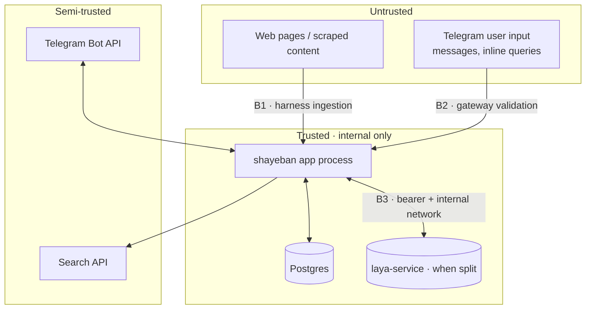

# Security Boundaries

> Part of the Shayeban architecture docs. Where the trust boundaries sit in
> the MVP, what crosses them, and the rules that keep untrusted input from
> reaching anything that can act on it. First-class, but sized for a
> local-first demo — not an internet-facing deployment.

## 1. Boundary map

## 2. B1 — Untrusted web content → harness

The single choke point for external content (`05-harness-and-news-ingestion.md`
§1). Rules:

- **Scraped content is data, never instructions.** Scripts/markup stripped
  before anything becomes evidence; content enters Laya state as quoted,
  delimited payload — prompt injection is contained where sanitization
  already lives, not re-handled at every layer.
- **Hard limits**: per-fetch byte caps, timeouts, content-type checks; the
  per-investigation budget (`05-…` §6) doubles as an abuse brake.
- **Source tiering before reasoning**: `forum`-tier content is discovery
  signal with near-zero proof weight — a hostile page cannot alone produce a
  confident verdict (`08-evidence-and-source-weighting.md`).
- Evidence provenance (URL, domain, fetch time) is stored on every item so
  any verdict can be audited back to what we actually saw.

## 3. B2 — Telegram input → gateway

- Validate/normalize all updates at the edge (`bot_gateway`): length caps,
  language handling, no trust in entity metadata.
- **Per-user quotas** (`users.daily_quota_used`) + per-investigation budgets
  prevent a single actor from burning search/API spend.
- Group gate (Laya detection) before a investigation row is created — spam
  costs one classification, not the pipeline.
- Bot token never appears in logs (redact at the logging boundary).

## 4. B3 — Internal services

| Rule | MVP stance |
|---|---|
| Postgres | bound to the compose network only; never published to the host unless debugging (and then localhost) |
| `laya-service` (when it exists) | internal network only + `LAYA_API_KEY` bearer (supported natively by `laya.serve`) |
| App HTTP surface (`api/`) | `/health` unauthenticated by design; anything state-changing gets a token before it is exposed beyond localhost |
| Traefik / public exposure | only if a demo must leave the laptop; not a default |
| TLS | belongs to whatever reverse proxy fronts a future deployment — out of MVP scope |

## 5. Secrets & supply chain

- Secrets live in `.env` (git-ignored) locally and in GitHub Actions secrets
  in CI (`TELEGRAM_*` already) — never in source, never in images.
- Lockfile-pinned Python dependencies; pinned base images by tag; model
  weights pinned by HF revision (`10-devops-mlops.md` §5).
- Least privilege is trivial at this scale and still enforced: the app is the
  only process that may reach DB and model service.

## 6. Output & data handling

- Explanations are template-rendered from stored evidence — the bot never
  emits model-generated prose that we cannot audit (`explanation/`).
- User identifiers stored for quotas/history; retention policy for raw
  message text is an open item (deferred with the feedback loop — see
  `12-future-evolution.md`).
- `NEEDS_REVIEW` cases keep humans in the loop before anything questionable
  is amplified (`04-fsm.md`).

## 7. Explicitly deferred

Internet-facing deployment hardening (rate limiting at the edge, WAF,
secrets manager, key rotation, formal threat model, dependency-scanning
cadence in CI) — each earns its place when the system leaves the laptop
(`12-future-evolution.md`).
