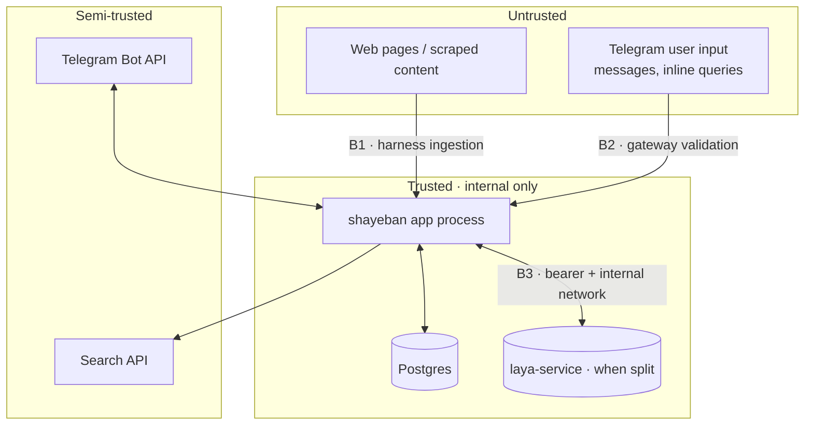

# Security Boundaries

> Part of the Shayeban architecture docs. Where the trust boundaries sit in
> the MVP, what crosses them, and the rules that keep untrusted input from
> reaching anything that can act on it. First-class, but sized for a
> local-first demo — not an internet-facing deployment.

## 1. Boundary map

## 2. B1 — Untrusted web content → harness

The single choke point for external content (`05-harness-and-news-ingestion.md`
§1). Rules:

- **Scraped content is data, never instructions.** Scripts/markup stripped
  before anything becomes evidence; content enters Laya state as quoted,
  delimited payload — prompt injection is contained where sanitization
  already lives, not re-handled at every layer.
- **Hard limits**: per-fetch byte caps, timeouts, content-type checks; the
  per-investigation budget (`05-…` §6) doubles as an abuse brake.
- **Source tiering before reasoning**: `forum`-tier content is discovery
  signal with near-zero proof weight — a hostile page cannot alone produce a
  confident verdict (`08-evidence-and-source-weighting.md`).
- Evidence provenance (URL, domain, fetch time) is stored on every item so
  any verdict can be audited back to what we actually saw.

## 3. B2 — Telegram input → gateway

- Validate/normalize all updates at the edge (`bot_gateway`): length caps,
  language handling, no trust in entity metadata.
- **Per-user quotas** (`users.daily_quota_used`) + per-investigation budgets
  prevent a single actor from burning search/API spend.
- Group gate (Laya detection) before a investigation row is created — spam
  costs one classification, not the pipeline.
- Bot token never appears in logs (redact at the logging boundary).

## 4. Malicious claims (either surface)

A claim is untrusted *content*, not untrusted *instructions* — the same
stance as scraped pages, applied to what users type:

- **Injection through the claim itself** ("ignore previous instructions…"):
  the claim is data inside the state payload, delimited and length-capped.
  Structural backstop: Laya answers **fixed option sets** — there is no free
  text channel through which a claim can steer the model into an arbitrary
  output (`06-laya.md` §2). Detection/verdict questions have no "other"
  option to smuggle text into.
- **Social-engineering claims**: text impersonating officials or demanding
  urgency cannot change tiers or weights — `sources.tier` is looked up by
  domain, never inferred from the claim's wording.
- **Cost abuse**: a claim crafted to force maximum searches/fetches is
  bounded by the per-investigation budget (`05-…` §6) and per-user quotas;
  the search API key never sees unbounded spend from one actor.
- **Brigading** (many accounts forwarding one claim): quota per user,
  clustering collapses duplicates — repetition updates counters, never
  weights (`08-…` §2).

## 5. B3 — Internal services

| Rule | MVP stance |
|---|---|
| Postgres | bound to the compose network only; never published to the host unless debugging (and then localhost) |
| `laya-service` (when it exists) | internal network only + `LAYA_API_KEY` bearer (supported natively by `laya.serve`) |
| App HTTP surface (`api/`) | `/health` unauthenticated by design; anything state-changing gets a token before it is exposed beyond localhost |
| Traefik / public exposure | only if a demo must leave the laptop; not a default |
| TLS | belongs to whatever reverse proxy fronts a future deployment — out of MVP scope |

## 6. Secrets & API keys

| Secret | Where it lives | Never |
|---|---|---|
| `BOT_TOKEN` | local `.env` (git-ignored); not needed in CI | source code, image layers, logs |
| `SEARCH_API_KEY` | local `.env` only | logged (log provider + call counts, not the key), sent anywhere but the provider |
| `DATABASE_URL` | compose env | hard-coded DSNs, host-published Postgres |
| `TELEGRAM_*` | GitHub Actions **secrets** (notify workflow only) | fork PRs (GitHub withholds them by design), workflow files |
| `LAYA_API_KEY` | internal compose env (when `laya-service` exists) | anything outside the internal network |

General: `.env.example` documents every key with a placeholder; startup
validation fails fast on missing keys rather than running degraded; nothing
secret in images (build args are not a secret store).

Supply chain: lockfile-pinned dependencies (audited in CI — `devops.md` §4),
pinned base images, model weights pinned by HF revision (`mlops.md` §3).
Least privilege at this scale means exactly one process (the app) may reach
the database and the model service.

## 7. Docker boundaries

- Images built **from this repo's Dockerfile only** — no third-party app
  images; base images pinned by tag (`deployment.md` §2).
- App container runs as a **non-root user**; no `--privileged`, no Docker
  socket mount, no host networking.
- Services join the internal compose network; **no published ports by
  default** — debug mappings bind `127.0.0.1` explicitly
  (`deployment.md` §3).
- Postgres data in a named volume, not bind-mounted into a shared workspace.

## 8. GitHub Actions

- Workflows run on `pull_request` (never `pull_request_target`) so fork PRs
  execute **without** secrets and without write token exposure
  (`devops.md` §5).
- Job `permissions` set to the minimum needed (the notify workflow needs
  read + its secrets; CI jobs need checks:write at most).
- No secrets in `docker build` args, cache keys, or artifact names; CI does
  not deploy, so it holds no deployment credentials.

## 9. Output & data handling

- Explanations are template-rendered from stored evidence — the bot never
  emits model-generated prose that we cannot audit (`explanation/`).
- User identifiers stored for quotas/history; retention policy for raw
  message text is an open item (deferred with the feedback loop — see
  `future-evolution.md`).
- `NEEDS_REVIEW` cases keep humans in the loop before anything questionable
  is amplified (`04-fsm.md`).

## 10. Explicitly deferred

Internet-facing deployment hardening (rate limiting at the edge, WAF,
secrets manager, key rotation, formal threat model, dependency-scanning
cadence in CI) — each earns its place when the system leaves the laptop
(`future-evolution.md`).

---

**16/21** · [← Observability](observability.md) · [Docs index](README.md) · [Future evolution →](future-evolution.md)
